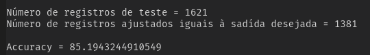

# REDES NEURAIS ARTIFICIAS - PPGEE / UFPA

### Implementação do algoritmo Backpropagation padrão

Executa o controle de versão dos código fonte desenvolvido para disciplina

> **Overview**

- [x] Apresentação do gráfico de evolução do erro médio quadrático ao longo das iterações/épocas;
- [x] Apresentação gráfica da saída desejada versus saída calculada pela rede neural;
- [x] Possibilidade de variação do número de neurônios na camada escondida (uma camada escondida);
- [ ] Possibilidade de verificação dos valores de pesos sinápticos após finalização do treinamento
    - Este requisito pode ser verificado no momento por meio da execução de forma iterativa (VS-Code)

> **Resultados alcançados**

*Gráficos*

*Saída do terminal*

